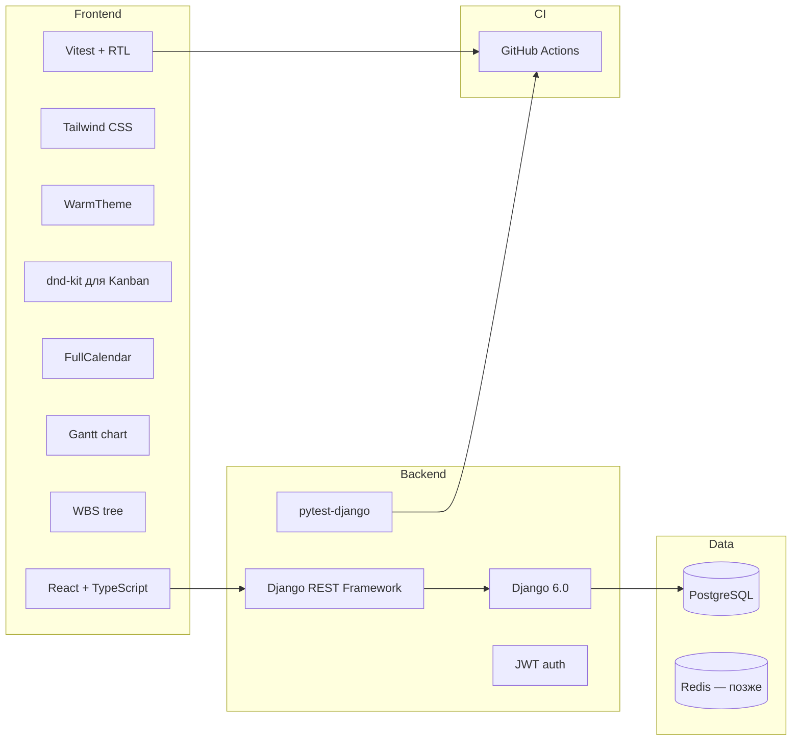
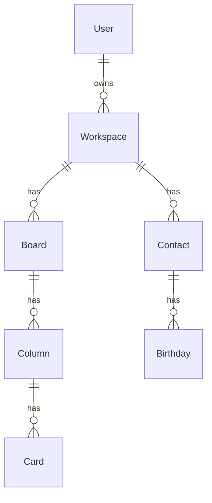
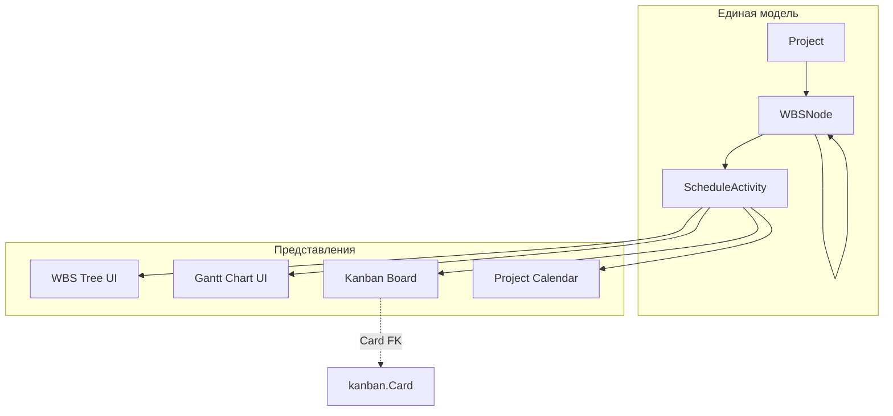
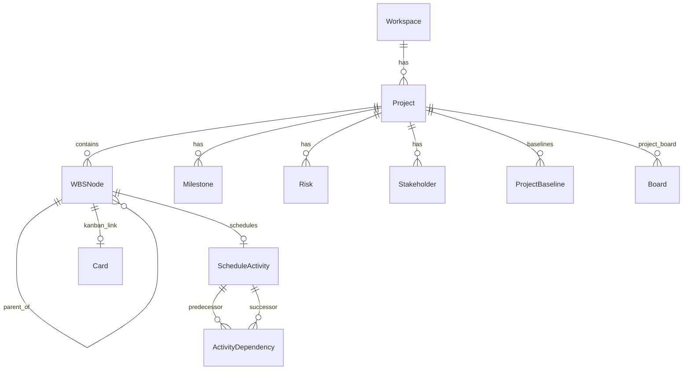

# План: личный планировщик на Django 6 (Kanban + календарь ДР)

> Мультипользовательский планировщик на Django 6 (venv) + DRF + React SPA.  
> Тёплый современный UI, автотесты на каждом этапе, инкрементальные git-коммиты в процессе разработки.

## Чеклист задач

### Выполнено (MVP)
- [x] Создать `backend/`: Django 6.0 + DRF + JWT + PostgreSQL + apps + pytest-django
- [x] Создать `frontend/`: Vite + React + TS + Tailwind + тёплая тема + Vitest
- [x] Регистрация/логин, Workspace, тесты auth и permissions + коммит
- [x] Board/Column/Card API, drag-and-drop, тесты Kanban + коммит
- [x] Contact/Birthday, FullCalendar, upcoming widget, тесты + коммит
- [x] Docker Compose, CI (pytest + vitest), адаптив, финальная полировка UI + коммит

### Фаза 5 — Управление проектами (PMBOK)
- [x] Модели Project, WBS, Schedule, связь с Kanban/календарём + backend tests
- [x] WBS: иерархическое дерево работ (CRUD, drag-reorder) + UI
- [x] Gantt: диаграмма Ганта, зависимости, drag дат + UI
- [x] Синхронизация WBS ↔ Gantt ↔ Kanban ↔ календарь + integration tests
- [x] PMBOK-модули: риски, стейкхолдеры, устав, RACI, baseline, CPM/EVM

### Фаза 6 — Расширение
- [x] Модуль `finance`: транзакции, бюджет проекта, сводка
- [x] Shared workspaces: приглашения, роли, участники
- [x] Уведомления: in-app notifications (риски, вехи, ДР)
- [x] Экспорт: JSON status report проекта

---

## Краткий ответ

**Да, это возможно**, и **Django выбран правильно** для вашей дорожной карты.

| Критерий | Почему Django подходит |
|----------|------------------------|
| Мультипользовательность | Встроенная auth, permissions, изоляция данных по `user`/`workspace` |
| Kanban + календарь | CRUD, связи между сущностями, ORM — типичная зона Django |
| Учёт и проекты позже | Сложные модели, транзакции, отчёты, admin — сильные стороны Django |
| SPA (ваш выбор) | Django REST Framework (DRF) — зрелый API-слой |

**Версия Django:** в `venv` установлен **Django 6.0.6** — используем его как целевую версию backend.

---

## Рекомендуемый стек



- **Backend:** Django **6.0** + DRF + `djangorestframework-simplejwt`
- **Frontend:** React + TypeScript + Vite + Tailwind CSS + [shadcn/ui](https://ui.shadcn.com)
- **Kanban:** `@dnd-kit/core`
- **Календарь:** `@fullcalendar/react`
- **Gantt (фаза 5):** `frappe-gantt` или `gantt-task-react` (лёгкая OSS-альтернатива)
- **WBS (фаза 5):** древовидный UI на `@dnd-kit` + custom tree / `react-arborist`
- **БД:** PostgreSQL (SQLite — только для локальных pytest без Docker)
- **Тесты backend:** `pytest` + `pytest-django` + `factory_boy`
- **Тесты frontend:** `Vitest` + `@testing-library/react`
- **CI:** GitHub Actions — `pytest` и `vitest` на каждый push
- **Репозиторий:** монорепо `backend/` + `frontend/`

---

## Дизайн: тёплый современный интерфейс

Рекомендация: **«Warm Clarity»** — светлая тёплая тема по умолчанию, мягкие акценты, холодные серые только для вторичного текста. Так интерфейс остаётся уютным, но иерархия и читаемость не страдают (в отличие от полностью «пастельного» UI, где всё сливается).

### Палитра (CSS variables в `frontend/src/styles/theme.css`)

| Роль | Цвет | Назначение |
|------|------|------------|
| Background | `#FAF7F2` (cream) | Основной фон — не холодный белый |
| Surface | `#FFFFFF` | Карточки, колонки Kanban, модалки |
| Primary | `#C45C3E` (terracotta) | Кнопки, активные пункты меню, CTA |
| Primary hover | `#A84B32` | Hover-состояния |
| Secondary | `#6B8F71` (sage) | Успех, метки «готово», вторичные акценты |
| Accent | `#E8A838` (amber) | Дни рождения, напоминания, бейджи |
| Text primary | `#2D2926` (warm charcoal) | Заголовки, основной текст |
| Text muted | `#6B6560` | Подписи, placeholder |
| Border | `#E8E2D9` | Разделители, рамки карточек |

### Принципы UX (логичность + приятность)

1. **Одна главная задача на экран** — Kanban и календарь на отдельных страницах; дашборд — сводка (ближайшие ДР + быстрый доступ к доскам)
2. **Предсказуемая навигация** — sidebar: Dashboard | Kanban | Календарь | **Проекты** | Настройки
3. **Визуальная иерархия** — крупные заголовки, щедрые отступы (16–24px), скругления 10–12px, мягкие тени `shadow-sm` с тёплым оттенком
4. **Типографика** — [Nunito Sans](https://fonts.google.com/specimen/Nunito+Sans) или [DM Sans](https://fonts.google.com/specimen/DM+Sans) (мягче Inter, хорошо с тёплой палитрой)
5. **Kanban** — колонки на cream-фоне, карточки белые с тонкой border; drag — лёгкое поднятие и terracotta outline
6. **Календарь** — amber-бейджи на датах с ДР; контакты — аватар с инициалами на sage-фоне
7. **Тёмная тема (опционально, фаза 4)** — тёплый charcoal `#1C1917`, не холодный `#0f172a`; primary остаётся terracotta

shadcn/ui настраивается через `globals.css` — переопределяем `--primary`, `--background`, `--muted` под палитру выше.

Референсы по ощущению: теплота Bear App / Notion (светлая тема), структура Linear — без копирования.

---

## Архитектура данных (MVP)

Изоляция данных — через **workspace** (личное пространство; позже — shared workspaces).



**Ключевые правила:**
- Каждый API-запрос фильтруется по `request.user` и его `workspace`
- Kanban: `position` + `PATCH /cards/{id}/move/`
- Дни рождения: `birth_date`; API отдаёт «следующее наступление» (29 февраля → 28.02 в невисокосный год)

---

## Структура Django-приложений

| App | Ответственность |
|-----|-----------------|
| `accounts` | Регистрация, login, JWT, профиль |
| `workspaces` | Пространство, членство |
| `kanban` | Board, Column, Card, reorder API |
| `birthdays` | Contact, Birthday, события ДР |
| `projects` *(фаза 5)* | PMBOK: Project, WBS, Schedule, Risks, Stakeholders |
| *(позже)* `finance` | Транзакции, бюджеты, EVM (связь с Cost Management) |

---

## API (основные эндпоинты MVP)

**Auth:** `POST /api/auth/register/`, `login/`, `refresh/` · `GET /api/auth/me/`

**Kanban:** boards, columns, cards CRUD + `POST /api/cards/{id}/move/`

**Календарь:** contacts CRUD · `GET /api/calendar/birthdays/` · `GET /api/calendar/upcoming/`

---

## Автотесты (обязательная часть, не «в конце»)

Тесты пишутся **вместе с каждой фичей**, до коммита фазы.

### Backend (`backend/tests/` + `pytest.ini`)

| Область | Что тестировать | Инструмент |
|---------|-----------------|------------|
| Auth | register, login, invalid credentials, JWT refresh | `APIClient` + pytest |
| Permissions | user A не видит данные user B | factory_boy fixtures |
| Kanban | CRUD board/column/card, move, reorder | API tests |
| Calendar | CRUD contact, upcoming birthdays, leap year | API tests |
| Models | `__str__`, constraints, signals (auto workspace) | pytest-django |

```text
backend/
  tests/
    conftest.py          # user, workspace, authenticated_client fixtures
    test_auth.py
    test_kanban_permissions.py
    test_kanban_api.py
    test_calendar_api.py
```

Запуск: `pytest` из `backend/` (SQLite in-memory для скорости в CI).

### Frontend (`frontend/src/**/*.test.tsx`)

| Область | Что тестировать |
|---------|-----------------|
| Auth forms | валидация, submit, ошибки API |
| Kanban board | рендер колонок, отображение карточек |
| Calendar | рендер событий из mock data |
| Theme | CSS variables применены |

Запуск: `npm run test` (Vitest).

### CI (`.github/workflows/ci.yml`)

- Backend: `pytest --cov` (порог coverage ≥ 80% для `apps/`)
- Frontend: `vitest run`
- Оба job на push/PR

---

## Git-стратегия: коммиты в процессе работы

При реализации плана **каждая логически завершённая часть — отдельный коммит**. Не один большой коммит в конце.

### Формат сообщений (Conventional Commits)

```text
feat(backend): add Django 6 project scaffold with DRF
feat(auth): implement JWT registration and login API
test(auth): add registration and permission tests
feat(frontend): add warm theme and app layout shell
feat(kanban): implement board CRUD and drag-and-drop UI
test(kanban): add API and component tests for card move
chore(ci): add GitHub Actions for pytest and vitest
```

### План коммитов по фазам

| Фаза | Коммиты (примерно) |
|------|-------------------|
| 1 — Фундамент | scaffold backend → auth API + tests → frontend scaffold + theme → layout + auth UI + tests |
| 2 — Kanban | models + migrations → API + tests → frontend board + dnd + tests |
| 3 — Календарь | models + API + tests → FullCalendar UI + upcoming widget + tests |
| 4 — Полировка | Docker Compose → CI workflow → адаптив + error handling |
| 5 — PMBOK Projects | 5.1 core → 5.2 WBS → 5.3 Gantt → 5.4 sync → 5.5 risks/stakeholders → 5.6 CPM |

Правило: **тесты и код фичи — в одном или соседнем коммите**; не откладывать тесты «на потом».

---

## Поэтапная дорожная карта

### Фаза 1 — Фундамент
- Django 6.0 проект в `backend/`, DRF, JWT, CORS, PostgreSQL
- Модели `User`, `Workspace`, permissions
- pytest + conftest + первые тесты auth
- React + Vite + Tailwind + shadcn + **тёплая тема**
- Layout (sidebar, dashboard-заглушка), login/register
- **Коммиты:** scaffold → auth → frontend theme → auth UI

### Фаза 2 — Kanban MVP
- Board / Column / Card + move API
- Drag-and-drop (`@dnd-kit`), optimistic UI
- Тесты: CRUD, permissions, move, reorder
- Доска по умолчанию при регистрации
- **Коммиты:** models → API + tests → UI + tests

### Фаза 3 — Календарь дней рождения
- Contact, Birthday, API для FullCalendar
- Виджет «ближайшие ДР» на дашборде (amber-акценты)
- Тесты: upcoming, leap year, permissions
- **Коммиты:** backend → frontend → dashboard widget

### Фаза 4 — Полировка и деплой ✅
- Docker Compose, GitHub Actions CI, адаптив, обработка ошибок API
- **Коммиты:** docker → ci → polish

### Фаза 5 — Управление проектами по PMBOK

Цель: единый модуль управления проектами, где **WBS, Gantt, Kanban и календарь — разные представления одних и тех же работ**, а не четыре несвязанных инструмента.

#### Ключевая идея: единый источник правды — Work Package

Каждая исполняемая единица работы (пакет работ / activity) хранится один раз и отображается в четырёх видах:

| Представление | Что показывает | PMBOK-область |
|---------------|----------------|---------------|
| **WBS** | Иерархия deliverables и work packages | Scope Management |
| **Gantt** | Сроки, длительность, зависимости, critical path | Schedule Management |
| **Kanban** | Статус исполнения (To Do → In Progress → Done) | Execution / Agile |
| **Календарь** | Milestones, дедлайны, контрольные точки | Schedule Management |



#### Модель данных (фаза 5)



**Основные сущности:**

| Модель | Назначение |
|--------|------------|
| `Project` | Проект: название, описание, статус, даты, менеджер, workspace |
| `WBSNode` | Узел WBS: `code` (1.1, 1.1.2), `title`, `parent`, `node_type` (deliverable / work_package / milestone), `position` |
| `ScheduleActivity` | Расписание: `start_date`, `end_date`, `duration_days`, `progress_%`, `is_milestone`, связь 1:1 с work_package |
| `ActivityDependency` | Зависимость: FS/SS/FF/SF + lag (как в PMBOK / MS Project) |
| `Milestone` | Веха проекта (отображается в Gantt + FullCalendar) |
| `ProjectBaseline` | Снимок расписания для сравнения plan vs actual |
| `Risk` | Реестр рисков: описание, вероятность, влияние, статус, mitigation |
| `Stakeholder` | Стейкхолдер: имя, роль, интерес/влияние, контакт |
| `RACIEntry` | Матрица RACI: WBSNode × Stakeholder × R/A/C/I |
| `ProjectCharter` | Устав проекта: цели, критерии успеха, ограничения, допущения |

**Связь с существующим Kanban:**
- У каждого `Project` — своя `Board` (создаётся signal при создании проекта)
- `Card` получает опциональный `FK → WBSNode` (work package)
- Смена колонки Kanban обновляет `ScheduleActivity.progress` и наоборот
- Личная доска «Моя доска» остаётся для заметок вне проектов

**Связь с календарём:**
- `Milestone` и `ScheduleActivity` (с `is_milestone=True`) → события в `GET /api/projects/{id}/calendar/`
- На общем календаре workspace — фильтр: личные ДР | проектные вехи
- Дни рождения (`birthdays`) и проектный календарь — разные слои, один UI

#### PMBOK: области знаний в продукте

Не все 49 процессов PMBOK 7 нужны в личном PM-инструменте. Реалистичный набор для **полноценного, но практичного** управления:

| Область PMBOK | Функции в Fast Plan | Приоритет |
|---------------|---------------------|-----------|
| **Integration** | Устав проекта, статус-отчёт, change log, dashboard проекта | P1 |
| **Scope** | WBS, scope statement, requirements (чеклист на узле WBS) | P1 |
| **Schedule** | Gantt, зависимости, milestones, baseline, critical path | P1 |
| **Cost** | Бюджет проекта, planned vs actual cost *(связь с `finance` позже)* | P2 |
| **Quality** | Definition of Done, quality checklist на work package | P2 |
| **Resource** | Назначение участников workspace на activity, загрузка | P2 |
| **Communications** | Журнал решений, комментарии к WBS/activity | P2 |
| **Risk** | Risk register, матрица вероятность×влияние, план реагирования | P1 |
| **Stakeholder** | Stakeholder register, RACI-матрица | P1 |
| **Procurement** | — *(вне scope для личного инструмента)* | — |

#### API (фаза 5, основное)

**Проекты**
- `GET/POST /api/projects/`
- `GET/PATCH/DELETE /api/projects/{id}/`
- `GET /api/projects/{id}/dashboard/` — сводка: прогресс, риски, ближайшие вехи

**WBS**
- `GET /api/projects/{id}/wbs/` — дерево
- `POST /api/projects/{id}/wbs/` — создать узел
- `PATCH /api/wbs/{id}/` — rename, move parent, reorder
- `DELETE /api/wbs/{id}/`

**Расписание / Gantt**
- `GET /api/projects/{id}/schedule/` — activities + dependencies для Gantt
- `PATCH /api/activities/{id}/` — даты, progress, duration
- `POST /api/activities/{id}/dependencies/`
- `GET /api/projects/{id}/critical-path/` — критический путь (CPM)

**Синхронизация**
- `POST /api/wbs/{id}/link-card/` — привязать к Kanban-карточке
- `POST /api/projects/{id}/sync-kanban/` — пересобрать карточки из WBS work packages

**PMBOK-дополнения**
- `GET/POST /api/projects/{id}/risks/`
- `GET/POST /api/projects/{id}/stakeholders/`
- `GET/PATCH /api/projects/{id}/charter/`
- `GET /api/projects/{id}/raci/`
- `POST /api/projects/{id}/baselines/` — зафиксировать baseline

**Календарь проекта**
- `GET /api/projects/{id}/calendar/?year=&month=` — вехи и milestones для FullCalendar

#### UI (фаза 5)

Страница **`/projects/{id}`** с вкладками (tab navigation):

1. **Обзор** — charter, KPI, % complete, риски top-3, ближайшие вехи
2. **WBS** — collapsible tree, drag-reorder, код 1.1.1, тип узла, % готовности
3. **Gantt** — интерактивная диаграмма: drag баров, зависимости стрелками, zoom week/month
4. **Kanban** — доска проекта (существующий компонент, фильтр по project board)
5. **Календарь** — FullCalendar с вехами проекта
6. **Риски** — таблица + heat map вероятность×влияние
7. **Стейкхолдеры** — список + RACI-матрица
8. **Baseline** — сравнение plan vs actual (две линии на Gantt)

**Сквозная навигация:** клик по узлу WBS → подсветка на Gantt и карточке Kanban; клик по бару Gantt → открытие деталей work package.

#### Подфазы реализации (фаза 5)

| Подфаза | Содержание | Коммиты |
|---------|------------|---------|
| **5.1 — Ядро** | Project, WBSNode, ScheduleActivity, API, тесты | models → API → tests |
| **5.2 — WBS UI** | Дерево WBS, CRUD, drag-reorder | feat(wbs): tree UI |
| **5.3 — Gantt** | Gantt chart, dependencies, drag dates | feat(gantt): chart UI |
| **5.4 — Интеграция** | Связь WBS↔Gantt↔Kanban↔Calendar, sync signals | feat(projects): cross-view sync |
| **5.5 — PMBOK** | Risks, stakeholders, charter, RACI, baseline | feat(pmbok): risk + stakeholder modules |
| **5.6 — Аналитика** | Critical path, EVM-lite, project dashboard | feat(projects): CPM + dashboard |

#### Тесты (фаза 5)

| Область | Сценарии |
|---------|----------|
| WBS | create tree, move node, delete subtree, unique codes per project |
| Schedule | dependency types FS/SS, date shift cascade, critical path calculation |
| Sync | WBS progress ↔ Kanban column ↔ Gantt bar color |
| Calendar | milestone appears in project calendar API |
| Permissions | user A не видит проект user B |
| PMBOK | risk register CRUD, RACI uniqueness per WBS node |

#### Риски фазы 5

| Риск | Решение |
|------|---------|
| Слишком сложная синхронизация | Одна модель `ScheduleActivity`; представления — read/write разных полей |
| Gantt-библиотека ограничена | Начать с `frappe-gantt`; при нехватке — `gantt-task-react` |
| Дублирование Kanban | Project board отдельно от личной доски; Card.wbs_node FK |
| CPM сложен | MVP: только FS-зависимости; SS/FF/SF — подфаза 5.6 |
| Scope creep PMBOK | Чёткие подфазы; Procurement не делаем |

### Фаза 6 — Расширение (позже)
- Модуль `finance`: Cost Management, EVM, связь бюджета проекта с транзакциями
- Shared workspaces: приглашения, роли (owner/editor/viewer) на уровне проекта
- Уведомления: Celery + Redis (дедлайны, риски, ДР)
- Экспорт: PDF status report, MS Project XML / Primavera P6 (опционально)

---

## Риски и как их снять

| Риск | Решение |
|------|---------|
| Переусложнить MVP | Только 2 фичи + auth |
| Утечка данных | queryset filters + **обязательные** permission tests |
| Тёплые цвета снижают контраст | Проверка WCAG AA для text/background; terracotta только для кнопок, не для мелкого текста |
| Kanban lag | Optimistic UI + debounced PATCH |
| Пропуск тестов | CI блокирует merge без green pytest + vitest |
| Рассинхрон WBS/Gantt/Kanban | Единая модель Activity; Django signals + integration tests на sync |
| Перегруз PMBOK | Подфазы 5.1–5.6; Procurement вне scope |

---

## Первые шаги (фаза 5 — после подтверждения)

1. App `projects`: модели `Project`, `WBSNode`, `ScheduleActivity` → **коммит** `feat(projects): add core models`
2. WBS tree API + тесты → **коммит** `feat(wbs): add tree API`
3. Gantt schedule API + dependencies → **коммит** `feat(schedule): add gantt data API`
4. Связь Project → Board, Card.wbs_node → **коммит** `feat(projects): integrate kanban`
5. WBS tree UI → Gantt UI → вкладки проекта (по одному коммиту на подфазу)
