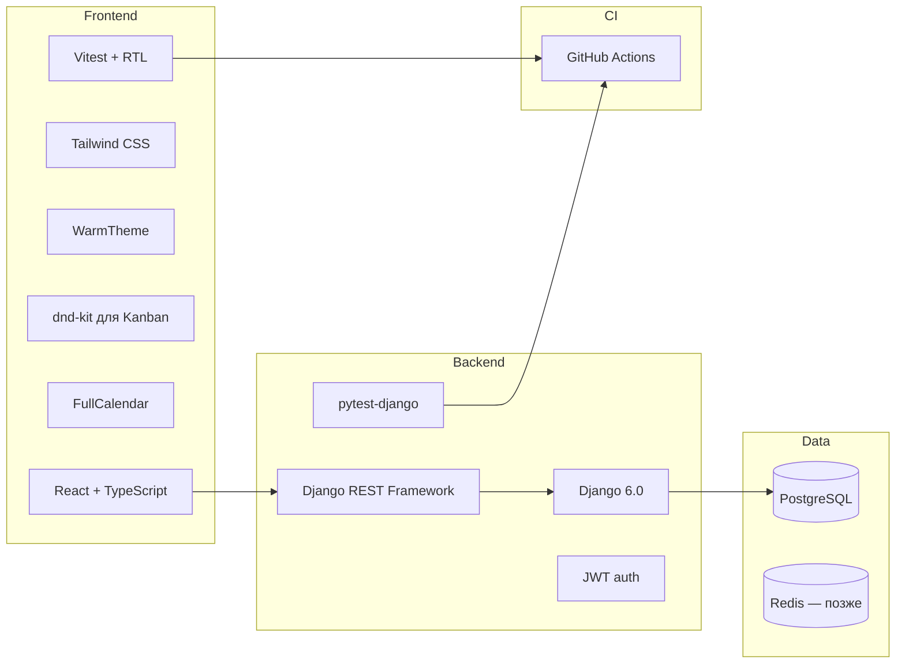
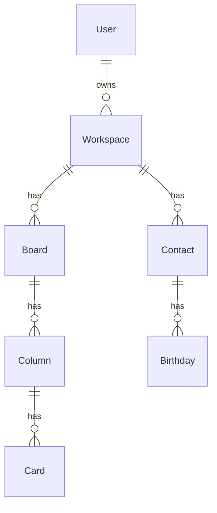

# План: личный планировщик на Django 6 (Kanban + календарь ДР)

> Мультипользовательский планировщик на Django 6 (venv) + DRF + React SPA.  
> Тёплый современный UI, автотесты на каждом этапе, инкрементальные git-коммиты в процессе разработки.

## Чеклист задач

- [ ] Создать `backend/`: Django 6.0 + DRF + JWT + PostgreSQL + apps + pytest-django
- [ ] Создать `frontend/`: Vite + React + TS + Tailwind + shadcn/ui + тёплая тема + Vitest
- [ ] Регистрация/логин, Workspace, тесты auth и permissions + коммит
- [ ] Board/Column/Card API, drag-and-drop, тесты Kanban + коммит
- [ ] Contact/Birthday, FullCalendar, upcoming widget, тесты + коммит
- [ ] Docker Compose, CI (pytest + vitest), адаптив, финальная полировка UI + коммит

---

## Краткий ответ

**Да, это возможно**, и **Django выбран правильно** для вашей дорожной карты.

| Критерий | Почему Django подходит |
|----------|------------------------|
| Мультипользовательность | Встроенная auth, permissions, изоляция данных по `user`/`workspace` |
| Kanban + календарь | CRUD, связи между сущностями, ORM — типичная зона Django |
| Учёт и проекты позже | Сложные модели, транзакции, отчёты, admin — сильные стороны Django |
| SPA (ваш выбор) | Django REST Framework (DRF) — зрелый API-слой |

**Версия Django:** в `venv` установлен **Django 6.0.6** — используем его как целевую версию backend.

---

## Рекомендуемый стек



- **Backend:** Django **6.0** + DRF + `djangorestframework-simplejwt`
- **Frontend:** React + TypeScript + Vite + Tailwind CSS + [shadcn/ui](https://ui.shadcn.com)
- **Kanban:** `@dnd-kit/core`
- **Календарь:** `@fullcalendar/react`
- **БД:** PostgreSQL (SQLite — только для локальных pytest без Docker)
- **Тесты backend:** `pytest` + `pytest-django` + `factory_boy`
- **Тесты frontend:** `Vitest` + `@testing-library/react`
- **CI:** GitHub Actions — `pytest` и `vitest` на каждый push
- **Репозиторий:** монорепо `backend/` + `frontend/`

---

## Дизайн: тёплый современный интерфейс

Рекомендация: **«Warm Clarity»** — светлая тёплая тема по умолчанию, мягкие акценты, холодные серые только для вторичного текста. Так интерфейс остаётся уютным, но иерархия и читаемость не страдают (в отличие от полностью «пастельного» UI, где всё сливается).

### Палитра (CSS variables в `frontend/src/styles/theme.css`)

| Роль | Цвет | Назначение |
|------|------|------------|
| Background | `#FAF7F2` (cream) | Основной фон — не холодный белый |
| Surface | `#FFFFFF` | Карточки, колонки Kanban, модалки |
| Primary | `#C45C3E` (terracotta) | Кнопки, активные пункты меню, CTA |
| Primary hover | `#A84B32` | Hover-состояния |
| Secondary | `#6B8F71` (sage) | Успех, метки «готово», вторичные акценты |
| Accent | `#E8A838` (amber) | Дни рождения, напоминания, бейджи |
| Text primary | `#2D2926` (warm charcoal) | Заголовки, основной текст |
| Text muted | `#6B6560` | Подписи, placeholder |
| Border | `#E8E2D9` | Разделители, рамки карточек |

### Принципы UX (логичность + приятность)

1. **Одна главная задача на экран** — Kanban и календарь на отдельных страницах; дашборд — сводка (ближайшие ДР + быстрый доступ к доскам)
2. **Предсказуемая навигация** — фиксированный sidebar: Dashboard | Kanban | Календарь | Настройки; активный пункт — terracotta-полоска слева
3. **Визуальная иерархия** — крупные заголовки, щедрые отступы (16–24px), скругления 10–12px, мягкие тени `shadow-sm` с тёплым оттенком
4. **Типографика** — [Nunito Sans](https://fonts.google.com/specimen/Nunito+Sans) или [DM Sans](https://fonts.google.com/specimen/DM+Sans) (мягче Inter, хорошо с тёплой палитрой)
5. **Kanban** — колонки на cream-фоне, карточки белые с тонкой border; drag — лёгкое поднятие и terracotta outline
6. **Календарь** — amber-бейджи на датах с ДР; контакты — аватар с инициалами на sage-фоне
7. **Тёмная тема (опционально, фаза 4)** — тёплый charcoal `#1C1917`, не холодный `#0f172a`; primary остаётся terracotta

shadcn/ui настраивается через `globals.css` — переопределяем `--primary`, `--background`, `--muted` под палитру выше.

Референсы по ощущению: теплота Bear App / Notion (светлая тема), структура Linear — без копирования.

---

## Архитектура данных (MVP)

Изоляция данных — через **workspace** (личное пространство; позже — shared workspaces).



**Ключевые правила:**
- Каждый API-запрос фильтруется по `request.user` и его `workspace`
- Kanban: `position` + `PATCH /cards/{id}/move/`
- Дни рождения: `birth_date`; API отдаёт «следующее наступление» (29 февраля → 28.02 в невисокосный год)

---

## Структура Django-приложений

| App | Ответственность |
|-----|-----------------|
| `accounts` | Регистрация, login, JWT, профиль |
| `workspaces` | Пространство, членство |
| `kanban` | Board, Column, Card, reorder API |
| `calendar` | Contact, Birthday, события |
| *(позже)* `projects` | Задачи, этапы |
| *(позже)* `finance` | Транзакции, бюджеты |

---

## API (основные эндпоинты MVP)

**Auth:** `POST /api/auth/register/`, `login/`, `refresh/` · `GET /api/auth/me/`

**Kanban:** boards, columns, cards CRUD + `POST /api/cards/{id}/move/`

**Календарь:** contacts CRUD · `GET /api/calendar/birthdays/` · `GET /api/calendar/upcoming/`

---

## Автотесты (обязательная часть, не «в конце»)

Тесты пишутся **вместе с каждой фичей**, до коммита фазы.

### Backend (`backend/tests/` + `pytest.ini`)

| Область | Что тестировать | Инструмент |
|---------|-----------------|------------|
| Auth | register, login, invalid credentials, JWT refresh | `APIClient` + pytest |
| Permissions | user A не видит данные user B | factory_boy fixtures |
| Kanban | CRUD board/column/card, move, reorder | API tests |
| Calendar | CRUD contact, upcoming birthdays, leap year | API tests |
| Models | `__str__`, constraints, signals (auto workspace) | pytest-django |

```text
backend/
  tests/
    conftest.py          # user, workspace, authenticated_client fixtures
    test_auth.py
    test_kanban_permissions.py
    test_kanban_api.py
    test_calendar_api.py
```

Запуск: `pytest` из `backend/` (SQLite in-memory для скорости в CI).

### Frontend (`frontend/src/**/*.test.tsx`)

| Область | Что тестировать |
|---------|-----------------|
| Auth forms | валидация, submit, ошибки API |
| Kanban board | рендер колонок, отображение карточек |
| Calendar | рендер событий из mock data |
| Theme | CSS variables применены |

Запуск: `npm run test` (Vitest).

### CI (`.github/workflows/ci.yml`)

- Backend: `pytest --cov` (порог coverage ≥ 80% для `apps/`)
- Frontend: `vitest run`
- Оба job на push/PR

---

## Git-стратегия: коммиты в процессе работы

При реализации плана **каждая логически завершённая часть — отдельный коммит**. Не один большой коммит в конце.

### Формат сообщений (Conventional Commits)

```text
feat(backend): add Django 6 project scaffold with DRF
feat(auth): implement JWT registration and login API
test(auth): add registration and permission tests
feat(frontend): add warm theme and app layout shell
feat(kanban): implement board CRUD and drag-and-drop UI
test(kanban): add API and component tests for card move
chore(ci): add GitHub Actions for pytest and vitest
```

### План коммитов по фазам

| Фаза | Коммиты (примерно) |
|------|-------------------|
| 1 — Фундамент | scaffold backend → auth API + tests → frontend scaffold + theme → layout + auth UI + tests |
| 2 — Kanban | models + migrations → API + tests → frontend board + dnd + tests |
| 3 — Календарь | models + API + tests → FullCalendar UI + upcoming widget + tests |
| 4 — Полировка | Docker Compose → CI workflow → адаптив + error handling |

Правило: **тесты и код фичи — в одном или соседнем коммите**; не откладывать тесты «на потом».

---

## Поэтапная дорожная карта

### Фаза 1 — Фундамент
- Django 6.0 проект в `backend/`, DRF, JWT, CORS, PostgreSQL
- Модели `User`, `Workspace`, permissions
- pytest + conftest + первые тесты auth
- React + Vite + Tailwind + shadcn + **тёплая тема**
- Layout (sidebar, dashboard-заглушка), login/register
- **Коммиты:** scaffold → auth → frontend theme → auth UI

### Фаза 2 — Kanban MVP
- Board / Column / Card + move API
- Drag-and-drop (`@dnd-kit`), optimistic UI
- Тесты: CRUD, permissions, move, reorder
- Доска по умолчанию при регистрации
- **Коммиты:** models → API + tests → UI + tests

### Фаза 3 — Календарь дней рождения
- Contact, Birthday, API для FullCalendar
- Виджет «ближайшие ДР» на дашборде (amber-акценты)
- Тесты: upcoming, leap year, permissions
- **Коммиты:** backend → frontend → dashboard widget

### Фаза 4 — Полировка и деплой
- Валидация, обработка ошибок, пагинация
- Docker Compose (web + db + frontend build)
- GitHub Actions CI
- Адаптив (mobile sidebar → drawer)
- Опционально: тёплая тёмная тема
- **Коммиты:** docker → ci → polish

### Фаза 5 — Расширение (позже)
- Проекты, учёт, shared workspaces, уведомления (Celery + Redis)

---

## Риски и как их снять

| Риск | Решение |
|------|---------|
| Переусложнить MVP | Только 2 фичи + auth |
| Утечка данных | queryset filters + **обязательные** permission tests |
| Тёплые цвета снижают контраст | Проверка WCAG AA для text/background; terracotta только для кнопок, не для мелкого текста |
| Kanban lag | Optimistic UI + debounced PATCH |
| Пропуск тестов | CI блокирует merge без green pytest + vitest |

---

## Первые шаги после подтверждения плана

1. `backend/` — Django 6.0.6 + DRF + pytest-django → **коммит** `feat(backend): scaffold Django 6 project`
2. Auth API + workspace signal + tests → **коммит** `feat(auth): ...`
3. `frontend/` — Vite + React + warm theme → **коммит** `feat(frontend): ...`
4. Layout + auth pages + tests → **коммит**
5. Kanban models → API → UI (каждый шаг с тестами и коммитом)
